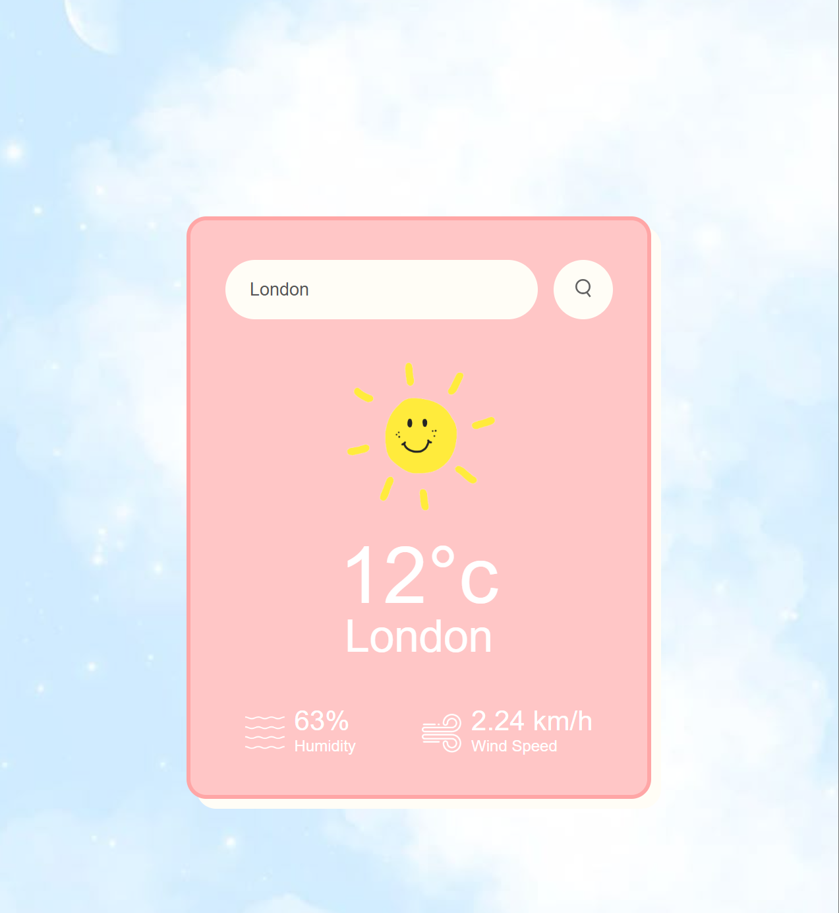

# 🌦️ PyScript Weather App

This is a clean, responsive weather app built using **HTML**, **CSS**, and **Python (via PyScript)** — no backend, no frameworks. It fetches real-time weather data from the OpenWeatherMap API and displays it beautifully with animated UI, weather-specific icons, and dynamic backgrounds for day and night. ☀️🌙

---

## 🚀 Features

- ✅ Built with **PyScript** — Python runs directly in the browser!
- 🌆 Enter a city name to get real-time weather info
- 🖼️ Dynamic weather icon + background (day/night sky)
- 🌬️ Shows temperature, humidity, wind speed
- ⚠️ Graceful error handling (shakes input + message for invalid cities)
- 💻 Fully styled with **CSS only** (no inline styling!)
- 🎯 Click the search button to fetch weather
- 💡 Expandable card layout — weather data only appears on success

---

## 📷 Preview

 <!-- Add a real screenshot image here -->

---

## 🛠️ Technologies Used

- 💻 HTML5 + CSS3
- 🐍 Python (with PyScript)
- 📦 OpenWeatherMap API
- 🎨 Custom animations and transitions

---

## 🔐 API Key Setup

This app uses the OpenWeatherMap API. To keep your API key safe:

1. **Create a file** called `key.js` in the root of the project directory.
2. Paste the following inside it:

```js
// key.js
window.API_KEY = "your_api_key_here";
```
3. The app will automatically load this key from `window.API_KEY`.
✅ The file is ignored by Git and not uploaded publicly.

---

## 📁 File Structure

```vbnet
weather-app/
├── index.html         ← Main HTML + PyScript
├── styles.css         ← All CSS styling
├── key.js             ← Your private API key (not uploaded!)
├── .gitignore         ← Prevents key.js from being pushed
├── README.md          ← This file :)
└── images/
    ├── sunny.png
    ├── cloudy.png
    ├── rainy.png
    ├── night-sky.jpg
    ├── day-sky.jpg
    └── ... (weather icons)
```

--- 

## 📦 Installation / Running

No frameworks, no npm, no setup — just open it in the browser!

### 👉 Steps:

1. Clone or download the repo  
2. Add your own `key.js` file as described above  
3. Open `index.html` in your browser (ideally using Live Server in VS Code)


---

## 🙋‍♀️ Author

👩‍💻 Developed with love by **Ruhani Sehgal**  
💬 Reach out if you'd like to collaborate or ask questions!

---

## 📜 License

This project is open-source and for educational/demonstration purposes.  
You are welcome to **fork**, modify, and build on it!
